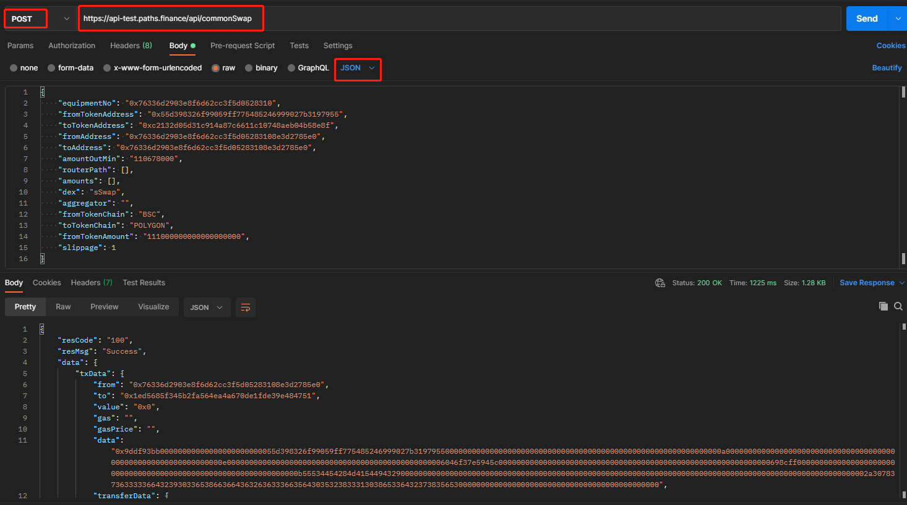

# 兑换接口

请求地址：/api/commonSwap

请求方式：POST

请求参数：

| 字段名称             | 字段描述                  | 类型      | 是否必须 | 备注                         |
| ---------------- | --------------------- | ------- | ---- | -------------------------- |
| equipmentNo      | 设备码                   | string  | 是    |                            |
| fromTokenAddress | 源币合约地址                | string  | 是    |                            |
| toTokenAddress   | 目标币合约地址               | string  | 是    |                            |
| fromAddress      | 源币用户地址                | string  | 是    |                            |
| toAddress        | 收币地址                  | string  | 是    |                            |
| amountOutMin     | 最小接收数量                | integer | 是    |                            |
| routerPath       | 兑换路径，如无指定路径，可设置为空数组   | array   | 是    | o3和类uniswap平台必传            |
| amounts          | 各路径最少收到币数量，如无路径，可设置为空 | array   | 否    | o3平台必传                     |
| dex              | 兑换平台名称                | string  | 是    | 用于区分使用渠道                   |
| aggregator       | 聚合器名称                 | string  | 否    | o3平台必传，代表其原链的单链兑换所使用的DEX名称 |
| fromTokenChain   | 源链                    | string  | 是    |                            |
| toTokenChain     | 目标链                   | string  | 是    |                            |
| fromTokenAmount  | 源币数量                  | integer | 是    |                            |
| slippage         | 滑点                    | decimal | 是    |                            |

输出参数：

| 字段名称     | 字段描述       | 类型      |
| -------- | ---------- | ------- |
| from     | 发起调用合约请求地址 | string  |
| to       | 被调用的合约地址   | string  |
| value    | 调用传入金额     | string  |
| gas      | gasLimit   | integer |
| gasPrice | gas价格      | string  |
| data     | 合约调用数据     | string  |

输入示例：

```
{
    "equipmentNo": "0x76336d2903e8f6d62cc3f5d0528310",
    "fromTokenAddress": "0xeeeeeeeeeeeeeeeeeeeeeeeeeeeeeeeeeeeeeeee",
    "toTokenAddress": "0xbb4cdb9cbd36b01bd1cbaebf2de08d9173bc095c",
    "fromAddress": "0x76336d2903e8f6d62cc3f5d05283108e3d2785e0",
    "toAddress": "0x76336d2903e8f6d62cc3f5d05283108e3d2785e0",
    "amountOutMin": "30427649999999997",
    "routerPath": [
        "0xeeeeeeeeeeeeeeeeeeeeeeeeeeeeeeeeeeeeeeee",
        "0xbb4cdb9cbd36b01bd1cbaebf2de08d9173bc095c"
    ],
    "amounts": [],
    "dex": "1inchSwap",
    "aggregator": "",
    "fromTokenChain": "BSC",
    "toTokenChain": "BSC",
    "fromTokenAmount": "30735000000000000",
    "slippage": 1
}
```

输出示例：

```
{
    "resCode": "100",
    "resMsg": "Success",
    "data": {
        "txData": {
            "from": "0x76336d2903e8f6d62cc3f5d05283108e3d2785e0",
            "to": "0x11111112542d85b3ef69ae05771c2dccff4faa26",
            "value": "0x6d3151d52bf000",
            "gas": 0,
            "gasPrice": "15000000000",
            "data": "0x7c025200000000000000000000000000baf9a5d4b0052359326a6cdab54babaa3a3a964300000000000000000000000000000000000000000000000000000000000000600000000000000000000000000000000000000000000000000000000000000180000000000000000000000000eeeeeeeeeeeeeeeeeeeeeeeeeeeeeeeeeeeeeeee000000000000000000000000bb4cdb9cbd36b01bd1cbaebf2de08d9173bc095c000000000000000000000000baf9a5d4b0052359326a6cdab54babaa3a3a964300000000000000000000000076336d2903e8f6d62cc3f5d05283108e3d2785e0000000000000000000000000000000000000000000000000006d3151d52bf000000000000000000000000000000000000000000000000000006bfe1cd8548f8000000000000000000000000000000000000000000000000000000000000000000000000000000000000000000000000000000000000000000000000000000100000000000000000000000000000000000000000000000000000000000000000000000000000000000000000000000000000000000000000000000000000003a00000000000000000000000000000000000000000000000000000000000000020000000000000000000000000000000000000000000000000000000000000000300000000000000000000000000000000000000000000000000000000000000600000000000000000000000000000000000000000000000000000000000000180000000000000000000000000000000000000000000000000000000000000024000000000000000000000000000000000000000000000000000000000000000000000000000000000000000000000000000000000000000000000000000000000000000000000000000000000000000000000000000000000000000000000000000000000000000000000000000000000000000000000000000000000000000800000000000000000000000000000000000000000000000000000000000000064d1660f99000000000000000000000000eeeeeeeeeeeeeeeeeeeeeeeeeeeeeeeeeeeeeeee000000000000000000000000a0102b2abb03234204dacba824c027f45aa6ccd700000000000000000000000000000000000000000000000000001bf40cc1d60000000000000000000000000000000000000000000000000000000000800000000000000000000000bb4cdb9cbd36b01bd1cbaebf2de08d9173bc095c0000000000000000000000000000000000000000000000000000000000000000000000000000000000000000000000000000000000000000006d155dc86a1a0000000000000000000000000000000000000000000000000000000000000000800000000000000000000000000000000000000000000000000000000000000004d0e30db00000000000000000000000000000000000000000000000000000000000000000000000000000000000000000000000000000000000000000000000000000000000000000000000000000000000000000000000000000000000000000000000000000000000000000000000000000000000000000000000000000000000000000000000000000000000000000000000000000000000000000000000800000000000000000000000000000000000000000000000000000000000000064d1660f99000000000000000000000000bb4cdb9cbd36b01bd1cbaebf2de08d9173bc095c00000000000000000000000076336d2903e8f6d62cc3f5d05283108e3d2785e0000000000000000000000000000000000000000000000000006d155dc86a1a0000000000000000000000000000000000000000000000000000000000cfee7c08"
        }
    }
}
```

Postman调用示例


