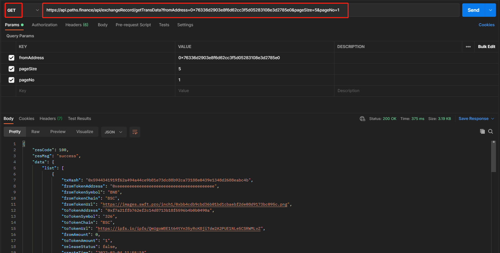

# 获取兑换信息列表接口

请求地址：/api/exchangeRecord/getTransData

请求方式：GET

请求参数：

| 字段名称        | 字段描述 | 类型      | 是否必须 | 备注 |
| ----------- | ---- | ------- | ---- | -- |
| fromAddress | 用户地址 | string  | 是    |    |
| pageSize    | 每页数量 | integer | 是    |    |
| pageNo      | 页码   | integer | 是    |    |

输出参数：定义同[添加兑换信息接口](tian-jia-dui-huan-xin-xi-jie-kou.md)返回。releaseStatus代表跨链时目标链是否兑换成功的状态，false：未成功，true：已成功。

输入示例：

[https://api.paths.finance/api/exchangeRecord/getTransData?fromAddress=0x76336d2903e8f6d62cc3f5d05283108e3d2785e0\&pageSize=5\&pageNo=1](https://api.paths.finance/api/exchangeRecord/getTransData?fromAddress=0x76336d2903e8f6d62cc3f5d05283108e3d2785e0\&pageSize=5\&pageNo=1)

输出示例：

```
{
    "resCode": 100,
    "resMsg": "success",
    "data": {
        "list": [
            {
                "txHash": "0xd5629104c4190c2bf161fba15ff3909148dcc12291e052479f0565761197f24e",
                "fromTokenAddress": "0xc2132d05d31c914a87c6611c10748aeb04b58e8f",
                "fromTokenSymbol": "USDT",
                "fromTokenChain": "POLYGON",
                "fromTokenUrl": "https://swap.swftcoin.com/swft-v3/images/coins/USDT(MATIC).png",
                "toTokenAddress": "0xa71edc38d189767582c38a3145b5873052c3e47a",
                "toTokenSymbol": "USDT",
                "toTokenChain": "HECO",
                "toTokenUrl": "https://images.swft.pro/heco/0xa71edc38d189767582c38a3145b5873052c3e47a.png",
                "fromAmount": 48.926755,
                "toTokenAmount": "48.026755",
                "releaseStatus": false,
                "createTime": "2022-02-28 11:55:47",
                "status": "success"
            },
            {
                "txHash": "0xbc6df2dd1a9d5c2b709a42d5cc02d6ec4c2692d9632f94a54fcf2e14f4fa717c",
                "fromTokenAddress": "0x55d398326f99059ff775485246999027b3197955",
                "fromTokenSymbol": "USDT",
                "fromTokenChain": "BSC",
                "fromTokenUrl": "https://images.swft.pro/inch1/0xdac17f958d2ee523a2206206994597c13d831ec7.png",
                "toTokenAddress": "0xc2132d05d31c914a87c6611c10748aeb04b58e8f",
                "toTokenSymbol": "USDT",
                "toTokenChain": "POLYGON",
                "toTokenUrl": "https://swap.swftcoin.com/swft-v3/images/coins/USDT(MATIC).png",
                "fromAmount": 49,
                "toTokenAmount": "48.926755",
                "releaseStatus": false,
                "createTime": "2022-02-28 11:45:21",
                "status": "success"
            },
            {
                "txHash": "0xccf4f3c08711aa6e3919f4b76ea9f55136d303f21e7f363b8db3e31605592c03",
                "fromTokenAddress": "0xc2132d05d31c914a87c6611c10748aeb04b58e8f",
                "fromTokenSymbol": "USDT",
                "fromTokenChain": "POLYGON",
                "fromTokenUrl": "https://swap.swftcoin.com/swft-v3/images/coins/USDT(MATIC).png",
                "toTokenAddress": "0xa71edc38d189767582c38a3145b5873052c3e47a",
                "toTokenSymbol": "USDT",
                "toTokenChain": "HECO",
                "toTokenUrl": "https://images.swft.pro/heco/0xa71edc38d189767582c38a3145b5873052c3e47a.png",
                "fromAmount": 69.637174,
                "toTokenAmount": "68.737174",
                "releaseStatus": false,
                "createTime": "2022-02-25 19:00:55",
                "status": "success"
            }
        ],
        "total": 31,
        "pageNo": "1"
    }
}
```

Postman调用示例


