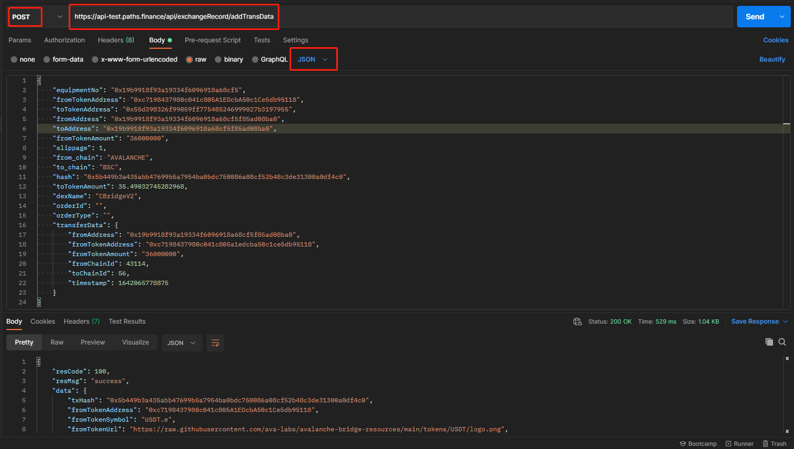

# 添加兑换信息接口

请求地址：/api/exchangeRecord/addTransData

请求方式：POST

请求参数：

| 字段名称             | 字段描述              | 类型      | 是否必须 | 备注            |
| ---------------- | ----------------- | ------- | ---- | ------------- |
| equipmentNo      | 设备码               | string  | 是    |               |
| fromTokenAddress | 源币合约地址            | string  | 是    |               |
| toTokenAddress   | 目标币合约地址           | string  | 是    |               |
| fromAddress      | 交易发起地址            | string  | 是    |               |
| toAddress        | 收币地址              | string  | 是    |               |
| fromTokenAmount  | 源币数量(带精度)         | string  | 是    |               |
| slippage         | 最大滑点，单位：%         | integer | 是    |               |
| fromChain        | 源链                | string  | 是    |               |
| toChain          | 目标链               | string  | 是    |               |
| hash             | 交易hash            | string  | 是    |               |
| toTokenAmount    | 目标币数量，除以decimal后  | decimal | 是    |               |
| dexName          | 兑换平台名称            | string  | 是    |               |
| orderId          | 订单id，如无填空字符串      | string  | 否    |               |
| orderType        | 订单类型，如无填空字符串      | string  | 否    |               |
| transferData     | 兑换自定义过程信息，如无填null | string  | 否    | 自定义过程，由兑换接口带回 |
| source           | 渠道的唯一标识           | string  | 否    |               |

输出参数：

| 字段名称             | 字段描述                                                                                        | 类型      |
| ---------------- | ------------------------------------------------------------------------------------------- | ------- |
| txHash           | 交易hash                                                                                      | string  |
| fromTokenAddress | 源币合约地址                                                                                      | string  |
| fromTokenSymbol  | 源币symbol                                                                                    | string  |
| fromTokenUrl     | 源币logo地址                                                                                    | string  |
| toTokenAddress   | 目标币合约地址                                                                                     | string  |
| toTokenSymbol    | 目标币symbol                                                                                   | string  |
| toTokenUrl       | 目标币logo地址                                                                                   | string  |
| fromAmount       | 源币数量，除以decimal后                                                                             | decimal |
| toTokenAmount    | 目标币数量，除以decimal后                                                                            | decimal |
| finalStatus      | 当前状态：pending：处理中，success：成功，fail：失败，wait\_kyc：等待kyc，wait\_refund：等待退币，refund\_complete：退币完成 | string  |
| createTime       | 创建时间                                                                                        | string  |
| status           | 兑换状态，第一个元素是源链兑换状态，第二个元素是目标链兑换状态                                                             | array   |

输入示例：

```
{
    "equipmentNo": "0x76336d2903e8f6d62cc3f5d0528310",
    "fromTokenAddress": "0xa71edc38d189767582c38a3145b5873052c3e47a",
    "toTokenAddress": "0xc2132d05d31c914a87c6611c10748aeb04b58e8f",
    "fromAddress": "0x76336d2903e8f6d62cc3f5d05283108e3d2785e0",
    "toAddress": "0x76336d2903e8f6d62cc3f5d05283108e3d2785e0",
    "fromTokenAmount": "48026755000000000000",
    "slippage": 1,
    "from_chain": "HECO",
    "to_chain": "POLYGON",
    "hash": "0x25bfd589d00e41a66e01ed3ad7c7b4b5765619cbb34232f33ee47fd6c5c09706",
    "toTokenAmount": 47.126755,
    "dexName": "AnySwapV3",
    "orderId": "",
    "orderType": "",
    "transferData": null
}
```

输出示例：

```
{
    "resCode": 100,
    "resMsg": "success",
    "data": {
        "txHash": "0x25bfd589d00e41a66e01ed3ad7c7b4b5765619cbb34232f33ee47fd6c5c09706",
        "fromTokenAddress": "0xa71edc38d189767582c38a3145b5873052c3e47a",
        "fromTokenSymbol": "USDT",
        "fromTokenUrl": "https://images.swft.pro/heco/0xa71edc38d189767582c38a3145b5873052c3e47a.png",
        "toTokenAddress": "0xc2132d05d31c914a87c6611c10748aeb04b58e8f",
        "toTokenSymbol": "USDT",
        "toTokenUrl": "https://swap.swftcoin.com/swft-v3/images/coins/USDT(MATIC).png",
        "fromAmount": 48.026755,
        "toTokenAmount": 47.126755,
        "finalStatus": "pending",
        "createTime": "2022-03-02 15:56:29",
        "status": [
            {
                "chain": "HECO",
                "txHash": "0x25bfd589d00e41a66e01ed3ad7c7b4b5765619cbb34232f33ee47fd6c5c09706",
                "url": "https://hecoinfo.com/tx/0x25bfd589d00e41a66e01ed3ad7c7b4b5765619cbb34232f33ee47fd6c5c09706",
                "status": "pending"
            }
        ]
    }
}
```

Postman调用示例


