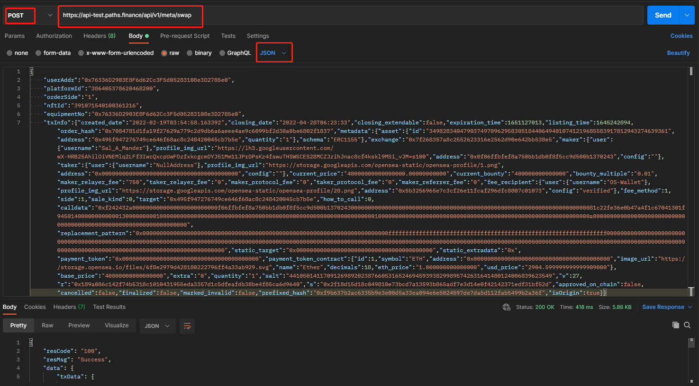

# 兑换接口

请求地址：/api/v1/meta/swap

请求方式：POST

请求参数：

| 字段名称        | 字段描述     | 类型      | 是否必须 | 备注 |
| ----------- | -------- | ------- | ---- | -- |
| equipmentNo | 设备码      | string  | 是    |    |
| userAddr    | 发起交易用户地址 | string  | 是    |    |
| txInfo      | 询价信息     | Object  | 是    |    |
| platformId  | 平台主键id   | integer | 是    |    |
| orderSide   | 1：买，0：卖  | string  | 是    |    |
| nftId       | NFT主键id  | integer | 是    |    |

输出参数：

| 字段名称  | 字段描述     | 类型      |
| ----- | -------- | ------- |
| from  | 交易发起地址   | string  |
| to    | 被调用的合约地址 | string  |
| value | 调用合约金额   | string  |
| gas   | gasLimit | integer |
| data  | 调用合约数据   | string  |

输入示例：

```
{
    "equipmentNo": "0x76336d2903e8f6d62cc3f5d0528310",
    "userAddr": "0x76336d2903e8f6d62cc3f5d05283108e3d2785e0",
    "txInfo": {
        "fromTokenAddress": "0xeeeeeeeeeeeeeeeeeeeeeeeeeeeeeeeeeeeeeeee",
        "fromChain": "BSC",
        "orderId": 420532,
        "isOrigin": true
    },
    "platformId": "386405400144891905",
    "orderSide": "1",
    "nftId": "392206623639753728"
}
```

输出示例：

```
{
    "resCode": "100",
    "resMsg": "Success",
    "data": {
        "txData": {
            "from": "0x76336d2903e8f6d62cc3f5d05283108e3d2785e0",
            "to": "0x76265575b884f2f7b26b6071e26ce17235184053",
            "value": "0x7bfd5d76a94000",
            "gas": 400000,
            "data": "0xab834bab00000000000000000000000076265575b884f2f7b26b6071e26ce1723518405300000000000000000000000076336d2903e8f6d62cc3f5d05283108e3d2785e0000000000000000000000000a1f4de8b9d05f78ee01cfd9e175eb60bb8fd677200000000000000000000000000000000000000000000000000000000000000000000000000000000000000009f0225d5c92b9cee4024f6406c4f13e546fd91a80000000000000000000000000000000000000000000000000000000000000000000000000000000000000000000000000000000000000000000000000000000000000000000000000000000076265575b884f2f7b26b6071e26ce17235184053000000000000000000000000a1f4de8b9d05f78ee01cfd9e175eb60bb8fd6772000000000000000000000000000000000000000000000000000000000000000000000000000000000000000046b8a16a8e40a1e8b32ecad531fdf00104471fb60000000000000000000000009f0225d5c92b9cee4024f6406c4f13e546fd91a80000000000000000000000000000000000000000000000000000000000000000000000000000000000000000000000000000000000000000000000000000000000000000000000000000000000000000000000000000000000000000000000c8000000000000000000000000000000000000000000000000000000000000000000000000000000000000000000000000000000000000000000000000000000000000000000000000000000000000000000000000000000000000000000000000000000000000000000000000000000000000000000000000007bfd5d76a940000000000000000000000000000000000000000000000000000000000000000000000000000000000000000000000000000000000000000000000000006207d01800000000000000000000000000000000000000000000000000000000000000000000000000000000000000000000000000000000000000000000017eee84ddc000000000000000000000000000000000000000000000000000000000000000c8000000000000000000000000000000000000000000000000000000000000000000000000000000000000000000000000000000000000000000000000000000000000000000000000000000000000000000000000000000000000000000000000000000000000000000000000000000000000000000000000007bfd5d76a940000000000000000000000000000000000000000000000000000000000000000000000000000000000000000000000000000000000000000000000000006207d01800000000000000000000000000000000000000000000000000000000000000000000000000000000000000000000000000000000000000000000017eee84ddc00000000000000000000000000000000000000000000000000000000000000001000000000000000000000000000000000000000000000000000000000000000000000000000000000000000000000000000000000000000000000000000000000000000000000000000000000000000000000000000000000000000000000000000000000000000000000000000000000000000000000000000000000000000100000000000000000000000000000000000000000000000000000000000000010000000000000000000000000000000000000000000000000000000000000000000000000000000000000000000000000000000000000000000000000000000000000000000000000000000000000000000000000000000000000000000006a0000000000000000000000000000000000000000000000000000000000000074000000000000000000000000000000000000000000000000000000000000007e0000000000000000000000000000000000000000000000000000000000000088000000000000000000000000000000000000000000000000000000000000009200000000000000000000000000000000000000000000000000000000000000940000000000000000000000000000000000000000000000000000000000000001b000000000000000000000000000000000000000000000000000000000000001b712b2c7fdd85a0976c696af82e1b3d366126e002b1718f82357a10558a98d04d181c9bbd0c34524bea6d50b0204a058df5cee1e216eaf9bc8f1ff2eccff4b66c712b2c7fdd85a0976c696af82e1b3d366126e002b1718f82357a10558a98d04d181c9bbd0c34524bea6d50b0204a058df5cee1e216eaf9bc8f1ff2eccff4b66c0000000000000000000000000000000000000000000000000000000000000000000000000000000000000000000000000000000000000000000000000000006423b872dd000000000000000000000000000000000000000000000000000000000000000000000000000000000000000076336d2903e8f6d62cc3f5d05283108e3d2785e000000000000000000000000000000000000000000000000000000000000fe68400000000000000000000000000000000000000000000000000000000000000000000000000000000000000000000000000000000000000000000006423b872dd000000000000000000000000a1f4de8b9d05f78ee01cfd9e175eb60bb8fd6772000000000000000000000000000000000000000000000000000000000000000000000000000000000000000000000000000000000000000000000000000fe68400000000000000000000000000000000000000000000000000000000000000000000000000000000000000000000000000000000000000000000006400000000ffffffffffffffffffffffffffffffffffffffffffffffffffffffffffffffff00000000000000000000000000000000000000000000000000000000000000000000000000000000000000000000000000000000000000000000000000000000000000000000000000000000000000000000000000000000000000000000000000000000000000000000000000000000000000000000000000000064000000000000000000000000000000000000000000000000000000000000000000000000ffffffffffffffffffffffffffffffffffffffffffffffffffffffffffffffff00000000000000000000000000000000000000000000000000000000000000000000000000000000000000000000000000000000000000000000000000000000000000000000000000000000000000000000000000000000000000000000000000000000000000000000000000000000000000000000000000000000"
        }
    }
}
```

Postman调用示例


