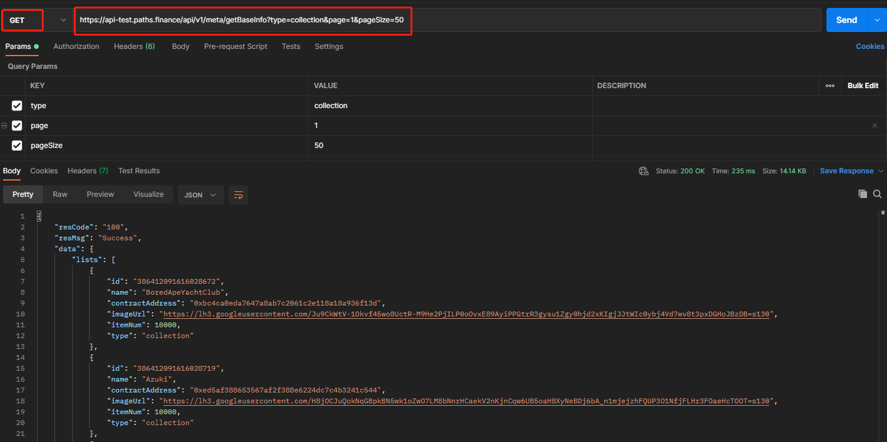

# 获取基本信息接口

请求地址：/api/v1/meta/getBaseInfo

请求方式：GET

请求参数：

| 字段名称     | 字段描述                     | 类型      | 是否必须 | 备注 |
| -------- | ------------------------ | ------- | ---- | -- |
| type     | 查询类型：collection、platform | string  | 是    |    |
| page     | 页码                       | integer | 是    |    |
| pageSize | 每页数量                     | integer | 是    |    |

输出参数：

| 字段名称            | 字段描述                   | 类型      |
| --------------- | ---------------------- | ------- |
| id              | 主键                     | integer |
| name            | 名称                     | string  |
| contractAddress | 合约地址                   | string  |
| imageUrl        | 图片logo地址               | string  |
| itemNum         | 数量                     | integer |
| type            | 类型，collection或platform | string  |

输入示例：

[https://api.paths.finance/api/v1/meta/getBaseInfo?type=collection\&page=1\&pageSize=50](https://api.paths.finance/api/v1/meta/getBaseInfo?type=collection\&page=1\&pageSize=50)

输出示例：

```
// type=collection返回数据
{
    "resCode": "100",
    "resMsg": "Success",
    "data": {
        "lists": [
            {
                "id": "386412091616028672",
                "name": "BoredApeYachtClub",
                "contractAddress": "0xbc4ca0eda7647a8ab7c2061c2e118a18a936f13d",
                "imageUrl": "https://lh3.googleusercontent.com/Ju9CkWtV-1Okvf45wo8UctR-M9He2PjILP0oOvxE89AyiPPGtrR3gysu1Zgy0hjd2xKIgjJJtWIc0ybj4Vd7wv8t3pxDGHoJBzDB=s130",
                "itemNum": 10000,
                "type": "collection"
            },
            {
                "id": "386412091616028695",
                "name": "MutantApeYachtClub",
                "contractAddress": "0x60e4d786628fea6478f785a6d7e704777c86a7c6",
                "imageUrl": "https://lh3.googleusercontent.com/lHexKRMpw-aoSyB1WdFBff5yfANLReFxHzt1DOj_sg7mS14yARpuvYcUtsyyx-Nkpk6WTcUPFoG53VnLJezYi8hAs0OxNZwlw6Y-dmI=s130",
                "itemNum": 17900,
                "type": "collection"
            },
           
            {
                "id": "386412091616028718",
                "name": "Pegas",
                "contractAddress": "0xd50d167dd35d256e19e2fb76d6b9bf9f4c571a3e",
                "imageUrl": "https://pegaxy.io/wp-content/uploads/2021/09/about-thumbnail3.png",
                "itemNum": 100,
                "type": "collection"
            }
        ],
        "total": 47
    }
}
```

```
// type=platform返回数据
{
    "resCode": "100",
    "resMsg": "Success",
    "data": {
        "lists": [
            {
                "id": "386405378620468200",
                "name": "OpenSea",
                "imageUrl": "https://opensea.io/static/images/logos/opensea.svg",
                "itemNum": 50000,
                "type": "platform"
            },
            {
                "id": "386405400144891905",
                "name": "Treasureland",
                "imageUrl": "https://d1xg70azqv21ps.cloudfront.net/static/logo.f397dcda.svg",
                "itemNum": 730,
                "type": "platform"
            },
            {
                "id": "386405400144891924",
                "name": "LooksRare",
                "imageUrl": "https://s3.us-east-2.amazonaws.com/nomics-api/static/images/currencies/LOOKS.jpg",
                "itemNum": 1000,
                "type": "platform"
            }
        ],
        "total": 13
    }
}
```

Postman调用示例


