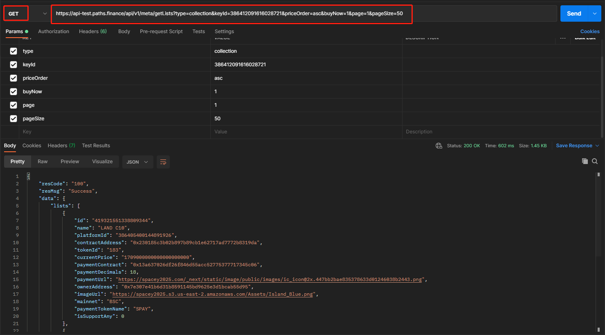

# 获取NFT列表接口

请求地址：/api/v1/meta/getLists

请求方式：GET

请求参数：

| 字段名称       | 字段描述                   | 类型      | 是否必须 | 备注                   |
| ---------- | ---------------------- | ------- | ---- | -------------------- |
| type       | 类型：collection、platform | string  | 是    |                      |
| keyId      | 主键id                   | integer | 是    | 对应基本信息接口返回的平台或者分类的ID |
| priceOrder | 价格排序标志位：asc升序，desc降序   | string  | 是    |                      |
| buyNow     | 是否获取可买条目：1是，0否         | integer | 是    |                      |
| page       | 页码                     | integer | 是    |                      |
| pageSize   | 每页数量                   | integer | 是    |                      |

输出参数：

| 字段名称             | 字段描述                  | 类型      |
| ---------------- | --------------------- | ------- |
| id               | NFT主键id               | integer |
| name             | NFT名称                 | string  |
| platformId       | 平台主键id                | integer |
| contractAddress  | NFT合约地址               | string  |
| tokenId          | tokenId               | string  |
| currentPrice     | 价格                    | string  |
| paymentContract  | 支付币种合约地址              | string  |
| paymentDecimals  | 支付币种小数位               | integer |
| paymentUrl       | 支付币种logo地址            | string  |
| ownerAddress     | 当前拥有者地址               | string  |
| imageUrl         | NFT图片地址               | string  |
| mainnet          | NFT所属链                | string  |
| paymentTokenName | 支付币种名称                | string  |
| isSupportAny     | 是否支持任意币种兑换：1：可以，0：不可以 | integer |

输入示例：

[https://api.paths.finance/api/v1/meta/getLists?type=collection\&keyId=386412091616028672\&priceOrder=asc\&buyNow=1\&page=1\&pageSize=50](https://api.paths.finance/api/v1/meta/getLists?type=collection\&keyId=386412091616028672\&priceOrder=asc\&buyNow=1\&page=1\&pageSize=50)

输出示例：

```
{
    "resCode": "100",
    "resMsg": "Success",
    "data": {
        "lists": [
            {
                "id": "391069956913074176",
                "name": "BoredApeYachtClub#2073",
                "platformId": "386405378620468200",
                "contractAddress": "0xbc4ca0eda7647a8ab7c2061c2e118a18a936f13d",
                "tokenId": "2073",
                "currentPrice": "1000069000000.000000000000000",
                "paymentContract": "0xa0b86991c6218b36c1d19d4a2e9eb0ce3606eb48",
                "paymentDecimals": 6,
                "paymentUrl": "https://storage.opensea.io/files/749015f009a66abcb3bbb3502ae2f1ce.svg",
                "ownerAddress": "0xb53349160e38739b37e4bbfcf950ed26e26fcb41",
                "imageUrl": "https://lh3.googleusercontent.com/gb_5zVcmUjLmU14vi9fIN3vAxmHD0x4hqEWpULXxULA8-y3E4bJTD9llj6DtAkno-YULH_FR2hU5PVRJ9DmFwh7eGL-8LgF7fnRVWxc",
                "mainnet": "ETH",
                "paymentTokenName": "USDC",
                "isSupportAny": 1
            },
            {
                "id": "406708667545485312",
                "name": "BoredApeYachtClub#4227",
                "platformId": "386405378620468200",
                "contractAddress": "0xbc4ca0eda7647a8ab7c2061c2e118a18a936f13d",
                "tokenId": "4227",
                "currentPrice": "85000000000000000000.00000000",
                "paymentContract": "0xeeeeeeeeeeeeeeeeeeeeeeeeeeeeeeeeeeeeeeee",
                "paymentDecimals": 18,
                "paymentUrl": "https://storage.opensea.io/files/6f8e2979d428180222796ff4a33ab929.svg",
                "ownerAddress": "0xcff3bc0454f3e154b5ad9737406338ab9bf47311",
                "imageUrl": "https://lh3.googleusercontent.com/hxkShKjlORLrbV7G9zLioJZjuMMG8WKUIg9p0Z7N_O2QOsxcxHOxQOrnQyXIMPibsMY4P8-G7LRjxwFbcwpfCfz9lR69ERFRLUYKaz0",
                "mainnet": "ETH",
                "paymentTokenName": "ETH",
                "isSupportAny": 1
            },
            {
                "id": "406705636922595328",
                "name": "BoredApeYachtClub#8855",
                "platformId": "386405378620468200",
                "contractAddress": "0xbc4ca0eda7647a8ab7c2061c2e118a18a936f13d",
                "tokenId": "8855",
                "currentPrice": "85000000000000000000.00000000",
                "paymentContract": "0xeeeeeeeeeeeeeeeeeeeeeeeeeeeeeeeeeeeeeeee",
                "paymentDecimals": 18,
                "paymentUrl": "https://storage.opensea.io/files/6f8e2979d428180222796ff4a33ab929.svg",
                "ownerAddress": "0xdbc5be1935a26335c19d337dccdaa3e003f7438f",
                "imageUrl": "https://lh3.googleusercontent.com/i0qDxQeyEH8DRrHyc9hrds7-6YlCUrHqSKvXnZARlwSrchnGkp_B5X_4GyocBDUt0-GIptCMPvmGrgs_Ffi1bJRbbmYPfhlffCWq3g",
                "mainnet": "ETH",
                "paymentTokenName": "ETH",
                "isSupportAny": 1
            }
        ],
        "total": 544
    }
}
```

Postman调用示例


