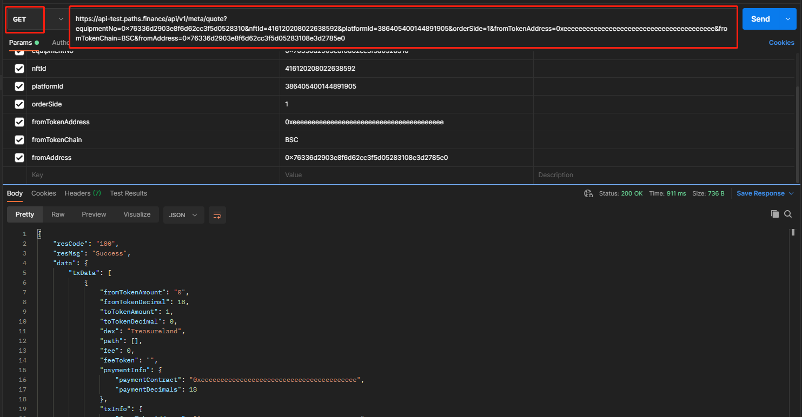

# 询价接口

请求地址：/api/v1/meta/quote

请求方式：GET

请求参数：

| 字段名称             | 字段描述        | 类型      | 是否必须 | 备注 |
| ---------------- | ----------- | ------- | ---- | -- |
| equipmentNo      | 设备码         | string  | 是    |    |
| nftId            | NFT主键ID     | integer | 是    |    |
| platformId       | NFT所在平台主键ID | integer | 是    |    |
| orderSide        | 1：买，0：卖     | string  | 是    |    |
| fromTokenAddress | 源币合约地址      | string  | 是    |    |
| fromTokenChain   | 源币所在链       | string  | 是    |    |
| fromAddress      | 交易发起地址      | string  | 是    |    |

输出参数：

| 字段名称             | 字段描述         | 类型      |
| ---------------- | ------------ | ------- |
| fromTokenAmount  | 源币数量，乘以精度后   | integer |
| fromTokenDecimal | 源币精度         | integer |
| toTokenAmount    | 目标币数量，除以精度后  | integer |
| toTokenDecimal   | 目标币精度        | integer |
| dex              | 兑换平台         | string  |
| path             | 兑换路径         | array   |
| fee              | 手续费金额        | decimal |
| feeToken         | 手续费支付token名称 | string  |
| logoUrl          | logo地址       | string  |
| platformId       | 平台主键id       | integer |
| paymentInfo      | 支付信息         | Object  |
| txInfo           | 兑换时需传回的参数    | Object  |

输入示例：

[https://api.paths.finance/api/v1/meta/quote?equipmentNo=0x76336d2903e8f6d62cc3f5d0528310\&nftId=391069956913074176\&platformId=386405378620468200\&orderSide=1\&fromTokenAddress=0xeeeeeeeeeeeeeeeeeeeeeeeeeeeeeeeeeeeeeeee\&fromTokenChain=ETH\&fromAddress=0x76336d2903e8f6d62cc3f5d05283108e3d2785e0](https://api.paths.finance/api/v1/meta/quote?equipmentNo=0x76336d2903e8f6d62cc3f5d0528310\&nftId=391069956913074176\&platformId=386405378620468200\&orderSide=1\&fromTokenAddress=0xeeeeeeeeeeeeeeeeeeeeeeeeeeeeeeeeeeeeeeee\&fromTokenChain=ETH\&fromAddress=0x76336d2903e8f6d62cc3f5d05283108e3d2785e0)

输出示例：

```
{
    "resCode": "100",
    "resMsg": "Success",
    "data": {
        "txData": [
            {
                "fromTokenAmount": 336640037000000000000,
                "fromTokenDecimal": 18,
                "toTokenAmount": 1,
                "toTokenDecimal": 0,
                "dex": "OpenSea",
                "path": [],
                "fee": 0,
                "feeToken": "",
                "logoUrl": "https://opensea.io/static/images/logos/opensea.svg",
                "platformId": "386405378620468200",
                "paymentInfo": {
                    "paymentContract": "",
                    "paymentDecimals": 18
                },
                "txInfo": {
                    "depositCoinCode": "ETH",
                    "fromTokenChain": "ETH",
                    "orderSide": 1,
                    "isOrigin": false
                }
            }
        ]
    }
}
```

Postman调用示例


